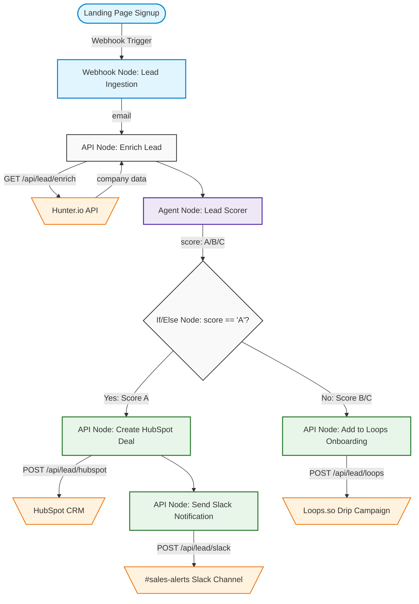

# 🔄 Smart Lead Enricher & CRM Syncer: Workflow Specification

This document describes the runtime execution flow, data schemas, and state transitions of the **B2B SaaS Lead Enrichment and CRM Syncing** workflow.

---

## 🌊 Pipeline Execution Flow

### 📊 Visual Workflow Diagram


### 📋 Text-based Execution Flow
```
[Landing Page Signup]
         │
         ▼  (Trigger Payload: email)
   1. Ingestion Webhook  ➔  Resolves client IP, source, and payload
         │
         ▼  (Query Parameters: email)
   2. Hunter.io API Node ➔  Fetches domain metadata & company metrics
         │
         ▼  (Enriched Payload: company details)
   3. Lead Scorer Agent  ➔  Applies ICP criteria and assigns Score A, B, or C
         │
         ▼  (Output Variable: score === "A"?)
   4. If/Else Node       ➔  Evaluates logical branching condition
         ├── [TRUE: Score A] ➔  5A. HubSpot Deal API  ➔  6A. Slack Webhook Node
         └── [FALSE: Score B/C] ➔ 5B. Loops Email Onboarding Node
```

---

## 📊 Phase-by-Phase Details

### Phase 1: Webhook Ingestion
* **Trigger Endpoint**: `POST /api/trigger/[agentId]`
* **Expected Payload**:
  ```json
  {
    "email": "lead@company.com",
    "signupSource": "homepage_hero",
    "timestamp": "2026-06-09T10:23:51Z"
  }
  ```
* **System Action**: Creates a new session in `TriggerRunTable` with `status: "pending"` and instantiates the multi-agent orchestrator.

### Phase 2: Enrichment Lookup
* **Target Node**: `Enrich Lead` API Node
* **API Route**: `GET /api/lead/enrich?email={{email}}`
* **Real API Connection**: Hunter.io Domain Search (`https://api.hunter.io/v2/domain-search`)
* **Output Payload (JSON)**:
  ```json
  {
    "success": true,
    "email": "lead@company.com",
    "domain": "company.com",
    "company": {
      "name": "Company Inc",
      "size": 250,
      "industry": "Software & Technology",
      "country": "United States",
      "isPersonalEmail": false
    }
  }
  ```

### Phase 3: Lead Scoring (AI Agent)
* **Target Node**: `Lead Scorer Agent`
* **Prompt Logic**: Analyzes the company metrics.
* **Output Schema (JSON)**:
  ```json
  {
    "score": "A",
    "reasoning": "Company size is 250 (exceeds 100 employee ICP threshold). Domain is a corporate domain.",
    "companyName": "Company Inc",
    "companySize": 250,
    "funding": "Seed/Growth",
    "industry": "Software & Technology"
  }
  ```

### Phase 4: Conditional Branching
* **Target Node**: `Check ICP Match` If/Else Node
* **Logical Condition**: `score == "A"`
* **Branch Results**:
  * **If True (Score A)**: Moves sequentially to HubSpot and Slack.
  * **If False (Score B/C)**: Moves to Loops.so.

### Phase 5A: Enterprise Sales Action (High-Value Path)
* **Integrations Triggered**:
  1. **HubSpot Deal Creation**:
     * **API Route**: `POST /api/lead/hubspot`
     * **Action**: Creates a Deal in the Sales Pipeline, automatically setting the contract value dynamically (e.g. employee count * $120/yr).
  2. **Slack Sales Notification**:
     * **API Route**: `POST /api/lead/slack`
     * **Action**: Formats a detailed warning block message and posts to `#sales-alerts` via an incoming webhook.

### Phase 5B: Product-Led Growth Action (Standard Path)
* **Integration Triggered**:
  1. **Loops Contact Subscription**:
     * **API Route**: `POST /api/lead/loops`
     * **Action**: Adds the lead to the subscriber database under the `Prospects` group, tagged with `score-b` or `score-c` to trigger the automated email sequence.

---

## 🛠️ Verification Command Line
To manually run the workflow via cURL or PowerShell:
```powershell
Invoke-RestMethod -Uri "http://localhost:3000/api/trigger/<your-agent-id>" `
    -Method Post `
    -Body '{"email": "alex@vercel.com"}' `
    -Headers @{"Content-Type"="application/json"}
```
