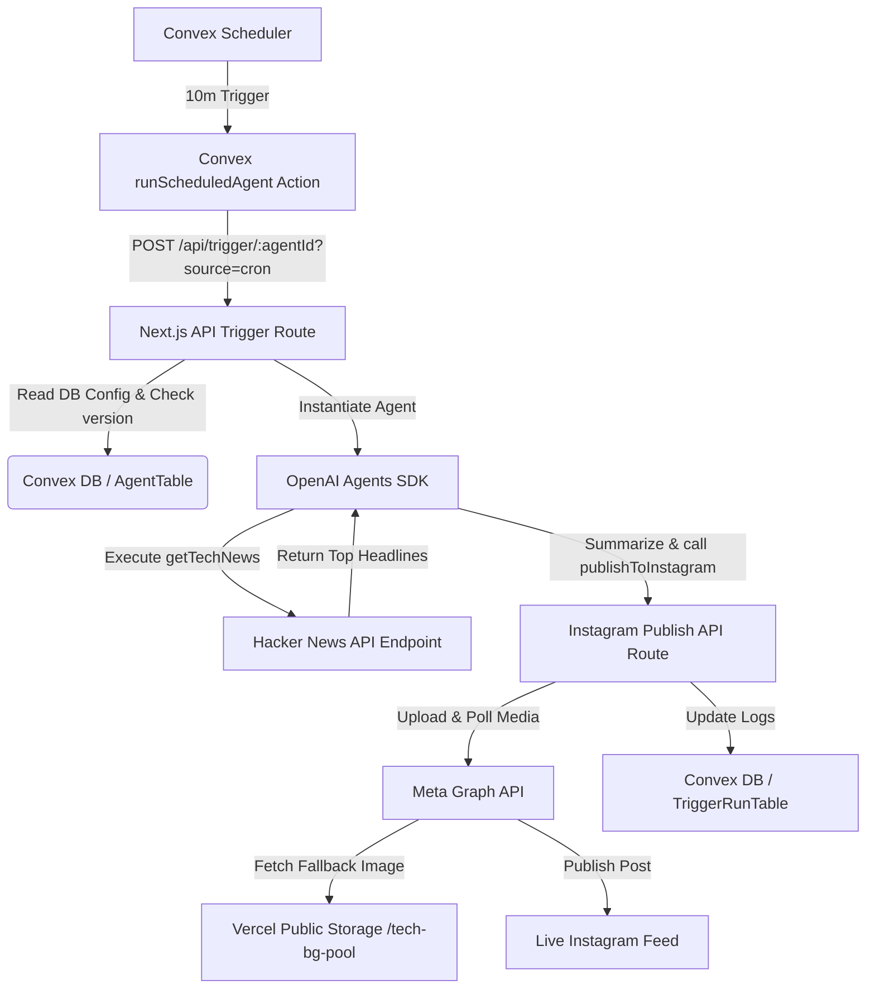

# 🚀 Instagram Tech News Publisher Agent: Implementation & Interview Guide

This guide details the step-by-step implementation of the automated **Instagram Tech News Publisher Agent** built within our AI Agent Visual Workflow Builder platform. It serves as both a production reference and a comprehensive technical handbook for interview preparation.

---

## 🏗️ Architecture Overview

The system is a fully automated, headless pipeline that executes the following workflow at periodic intervals:



---

## 🛠️ Step-by-Step Implementation (From Scratch)

### Step 1: Design the Workflow Nodes in the Builder
1. **Cron Trigger Node**: Configured to run every `10` minutes. Trigger prompt:
   > *"Delegate to InstagramPublisher to fetch the latest news from getTechNews, summarize it, and call publishToInstagram to post the update."*
2. **Agent Node (`InstagramPublisher`)**: The AI brain instructed to fetch, summarize, and trigger the Instagram publisher tool.
3. **API Nodes (Tools)**:
   - `getTechNews`: Fetches headlines from Hacker News.
   - `publishToInstagram`: Publishes the generated summary as an Instagram post.

### Step 2: Implement the Hacker News Tool API
We created `/api/news/route.ts` which acts as a proxy to the **Hacker News Algolia search API**. It fetches the top 5 front-page articles:
```typescript
// app/api/news/route.ts
import { NextResponse } from "next/server";

export async function GET() {
  try {
    const res = await fetch("https://hn.algolia.com/api/v1/search?tags=front_page&hitsPerPage=5");
    const data = await res.json();
    const articles = data.hits.map((hit: any) => ({
      title: hit.title,
      author: hit.author,
      points: hit.points,
      url: hit.url || `https://news.ycombinator.com/item?id=${hit.objectID}`,
    }));
    return NextResponse.json(articles);
  } catch (error: any) {
    return NextResponse.json({ error: error.message }, { status: 500 });
  }
}
```

### Step 3: Implement the Instagram Publish API
We created `/api/publish/instagram/route.ts` using the **Instagram Graph API**.
Publishing to Instagram is an asynchronous 3-step process:
1. **Create a Media Container**: Pass the `image_url` and `caption` to `/media`.
2. **Poll Status**: Periodically check if Meta has finished processing the image.
3. **Publish Container**: Once status is `FINISHED`, commit the publish action to `/media_publish`.

### Step 4: Add Crawler-Safe Fallback Image Rotation
* **The Problem**: The Instagram Graph API requires a publicly accessible image URL. External image CDNs (like Unsplash) block Meta's crawler bot (`facebookexternalhit`), leading to `The media could not be fetched` errors.
* **The Solution**: We self-hosted a collection of high-resolution abstract tech images in our Vercel `/public` directory (`tech-bg.jpg`, `tech-bg-2.jpg`, `tech-bg-3.jpg`, `tech-bg-4.jpg`).
* **Rotation Logic**: On each execution, if no valid image is supplied, we pick an image randomly from the pool:
```typescript
const FALLBACK_IMAGES = [
  "https://ai-agent-platform-n48i.vercel.app/tech-bg.jpg",
  "https://ai-agent-platform-n48i.vercel.app/tech-bg-2.jpg",
  "https://ai-agent-platform-n48i.vercel.app/tech-bg-3.jpg",
  "https://ai-agent-platform-n48i.vercel.app/tech-bg-4.jpg"
];

let imageUrl = searchParams.get("imageUrl") || "";
const isPlaceholder = !imageUrl || imageUrl.includes("unsplash.com") || !imageUrl.startsWith("http");

if (isPlaceholder) {
  imageUrl = FALLBACK_IMAGES[Math.floor(Math.random() * FALLBACK_IMAGES.length)];
}
```

### Step 5: Configure the Headless Scheduler in Convex
1. Set up a scheduler in `convex/trigger.ts` that runs as a background Convex Action.
2. The Action makes a POST request to `/api/trigger/[agentId]?source=cron` pointing to the production deployment.
3. Added the `APP_URL` variable to **Convex Environment Variables** so the serverless action knows the Vercel endpoint to hit.

---

## 🎯 Interview Q&A: Critical Challenges & Design Choices

### Q1: Why does publishing a photo to Instagram require a polling mechanism instead of a single API request?
**Answer**:
The Meta Graph API processes images asynchronously. 
* When you submit an image URL via the `/media` endpoint, Meta triggers an internal crawler to fetch, validate, compress, and cache that image on their CDNs. This takes time depending on network conditions and file size.
* The API returns a **Media Container ID** immediately. You must query `/v19.0/{containerId}?fields=status_code` periodically.
* Only when `status_code === "FINISHED"` can you call the `/media_publish` endpoint to push the post live. 
* If you attempt to publish before it finishes, or if the container returns `ERROR` (e.g., crawler timeout, invalid format), the publish fails. Our API handles this via an active `for` loop polling up to 8 times with 2-second sleep intervals.

### Q2: You ran into an issue where Unsplash images failed to post on Instagram even though the URLs worked in the browser. What was the root cause and how did you resolve it?
**Answer**:
* **Root Cause**: The Instagram API does not download the image from the client's browser; instead, Meta's background servers fetch it using the `facebookexternalhit` user-agent crawler. Unsplash (and several other CDNs) blocks Meta's crawler bot to prevent mass scraping and limit bandwidth costs. The browser works because it sends user-like request headers, but Meta's API gets a `403 Forbidden` response, causing a `Media could not be fetched` exception.
* **Resolution**: We bypass this by self-hosting fallback images directly inside our application's `public/` directory, hosted on Vercel. Since Meta does not block Vercel deployment URLs, the crawler successfully fetches the images. We then built a **randomized pool rotation** (`tech-bg-1` through `tech-bg-4`) in our Next.js backend API so that automated cron posts automatically rotate through different backgrounds to keep the feed visually dynamic.

### Q3: How did you prevent duplicate or stale cron executions when an agent is updated or unpublished?
**Answer**:
* **The Problem**: In serverless scheduler systems (like Convex's `ctx.scheduler`), schedules are queued into the future. If a user changes their cron interval from 10 minutes to 1 hour, or disables the agent entirely, there will still be old, pending 10-minute schedules waiting to execute. This leads to duplicate and stale cron runs.
* **The Solution**: We introduced a **`scheduleVersion` state check**.
  * Every agent document in the database tracks a `scheduleVersion` (integer).
  * When an agent is published, modified, or unpublished, this integer increments.
  * When scheduling a job, the scheduler payload includes the current `scheduleVersion`.
  * When the job starts running, the first step is to read the database. If the version in the payload does not match the database version, the job terminates immediately without performing any action (avoiding duplicates or stale runs).

### Q4: Why did we need to configure `APP_URL` in Convex instead of Vercel?
**Answer**:
* The scheduler engine runs on **Convex's serverless platform**, not on Vercel. 
* When the Convex scheduler executes `runScheduledAgent` (in `convex/trigger.ts`), it makes an outbound HTTP request to hit our Next.js API endpoint (`/api/trigger/[agentId]?source=cron`).
* Since Convex runs in a completely separate cloud sandbox from Next.js, it has no native context of our Vercel deployment URL. If `process.env.APP_URL` is undefined, it defaults to `http://localhost:3000`, which fails to connect in production.
* We resolved this by explicitly configuring `APP_URL=https://ai-agent-platform-n48i.vercel.app` in the **Convex Environment Variables** dashboard, enabling Convex actions to communicate with our Next.js production backend.

### Q5: How does the AI agent orchestrate tools (like `getTechNews` and `publishToInstagram`) dynamically under the hood?
**Answer**:
We use the `@openai/agents` SDK. 
1. The `/api/trigger/[agentId]` route loads the visual agent's configuration from Convex.
2. It loops through the defined tools and registers them as OpenAI `tool` definitions, mapping parameters (like `caption` and `imageUrl`) to runtime parameters.
3. The SDK creates an execution frame. The user prompt ("Delegate to InstagramPublisher...") is sent to the LLM.
4. The LLM acts as an orchestrator. It decides that it needs to call `getTechNews` first. The route runs the function, fetches the news, and passes the output back to the LLM.
5. The LLM synthesizes the headlines into a summary and reasons that it must call `publishToInstagram` with the summary as the `caption`.
6. The route runs `publishToInstagram`, posting the update, and returns the confirmation to the LLM to complete the chain.
