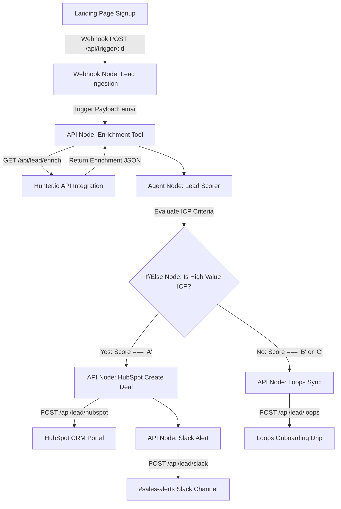

# 🚀 Smart Lead Enricher & CRM Syncer Agent: Technical Handbook & Implementation Guide

This handbook details the step-by-step implementation of the automated **Smart Lead Enricher & CRM Syncer Agent** built within our AI Agent Visual Workflow Builder platform. It outlines production-grade architecture, node configurations, API schemas, and serves as an interview preparation guide.

---

## 🏗️ Architecture Overview

The system is a headless, webhook-triggered multi-agent automation pipeline that ingests new signups, enriches lead profiles, scores prospects based on ICP criteria, and executes conditional branches to sync with CRMs, Slack, or Email tools.



---

## 🛠️ Step-by-Step Building Procedure

### Step 1: Design the Visual Workflow in the Builder
1. Add a **Webhook Trigger Node** as the starting point.
2. Add an **API Node** named `Enrich Lead` connected to the Webhook Node.
3. Add an **Agent Node** named `Lead Scorer Agent` connected to the API Node.
4. Add an **If/Else Node** named `Check ICP Match` connected to the Agent Node.
5. Add three **API Nodes** representing integrations:
   - `Create HubSpot Deal` (connected to the `if` handle of the If/Else Node).
   - `Send Slack Notification` (connected to the `if` handle, sequentially after HubSpot or in parallel).
   - `Add to Loops Onboarding` (connected to the `else` handle of the If/Else Node).
6. Connect all branches to an **End Node** to complete the workflow.

---

### Step 2: Configure Node Settings

#### 1. Webhook Trigger Node
* **Purpose**: Wait for landing page signup HTTP requests.
* **Webhook URL**: Automatically generated format:
  `http://localhost:3000/api/trigger/{agentId}`
* **Payload Format**: Receives a JSON body:
  ```json
  {
    "message": "Enrich lead for signup: alex@stripe.com",
    "email": "alex@stripe.com"
  }
  ```

#### 2. API Node: Enrichment Tool (`Enrich Lead`)
* **Request Method**: `GET`
* **API URL**: `/api/lead/enrich?email={{email}}`
* **Parameter Mapping**: URL includes `{{email}}`, which gets dynamically replaced by the LLM with the email parsed from the trigger input.

#### 3. Agent Node: `Lead Scorer Agent`
* **Model**: `gemini-pro-2.0` (or `gemini-flash-1.5`)
* **Output Format**: **JSON**
* **JSON Schema**:
  ```json
  {
    "score": "string (A, B, or C)",
    "reasoning": "string",
    "companyName": "string",
    "companySize": "number",
    "funding": "string",
    "industry": "string"
  }
  ```
* **System Instructions**:
  > *"You are a Sales Qualification and ICP (Ideal Customer Profile) Scoring Agent. You receive company details from the lead enrichment API. Analyze the company metrics and assign a Score (A, B, or C) based on these rules:*
  > 
  > *- **Score A (High Value ICP)**: Company size is 100+ employees OR Funding is $10M+ OR Industry is Cloud Infrastructure / Artificial Intelligence.*
  > *- **Score B (Medium Match)**: Company size is 20-99 employees OR Industry is Software & IT Services.*
  > *- **Score C (Low Match)**: Company size is 1-19 employees OR has a personal email (gmail, yahoo, outlook).*
  > 
  > *Always output your decision in JSON matching the requested schema. Do not output markdown code blocks, just raw JSON."*

#### 4. If/Else Node: `Check ICP Match`
* **Condition Configuration**:
  * **Variable to Check**: `score` (from the Lead Scorer Agent's output).
  * **Operator**: `==`
  * **Value**: `"A"`
* **Branching Handles**:
  * **if** (True): Routes to `Create HubSpot Deal`.
  * **else** (False): Routes to `Add to Loops Onboarding`.

#### 5. API Node: `Create HubSpot Deal` (Score A Path)
* **Request Method**: `POST`
* **API URL**: `/api/lead/hubspot`
* **Body Params (JSON)**:
  ```json
  {
    "email": "{{email}}",
    "score": "{{score}}",
    "company": {
      "name": "{{companyName}}",
      "size": "{{companySize}}",
      "funding": "{{funding}}",
      "industry": "{{industry}}"
    }
  }
  ```

#### 6. API Node: `Send Slack Notification` (Score A Path)
* **Request Method**: `POST`
* **API URL**: `/api/lead/slack`
* **Body Params (JSON)**:
  ```json
  {
    "email": "{{email}}",
    "score": "{{score}}",
    "company": {
      "name": "{{companyName}}",
      "size": "{{companySize}}",
      "funding": "{{funding}}",
      "industry": "{{industry}}"
    }
  }
  ```

#### 7. API Node: `Add to Loops Onboarding` (Score B/C Path)
* **Request Method**: `POST`
* **API URL**: `/api/lead/loops`
* **Body Params (JSON)**:
  ```json
  {
    "email": "{{email}}",
    "score": "{{score}}",
    "company": {
      "name": "{{companyName}}"
    }
  }
  ```

---

## 💻 Behind-the-Scenes API Integrations

We implemented production-ready Next.js API endpoints in the codebase that route queries securely to live APIs:

* **Enrichment API Endpoint** ([enrich/route.ts](file:///c:/AI-Agent-Platform/ai-agent/app/api/lead/enrich/route.ts)):
  Queries the live Hunter.io Domain Search API via `HUNTER_API_KEY` to extract corporate organization metadata.
* **HubSpot Create Deal Endpoint** ([hubspot/route.ts](file:///c:/AI-Agent-Platform/ai-agent/app/api/lead/hubspot/route.ts)):
  Uses the `HUBSPOT_ACCESS_TOKEN` to generate real deals inside your HubSpot pipelines with calculated pricing metrics.
* **Slack Webhook Alert Endpoint** ([slack/route.ts](file:///c:/AI-Agent-Platform/ai-agent/app/api/lead/slack/route.ts)):
  Forwards structured block messages directly to the live Slack channel URL set in `SLACK_WEBHOOK_URL`.
* **Loops Nurture Endpoint** ([loops/route.ts](file:///c:/AI-Agent-Platform/ai-agent/app/api/lead/loops/route.ts)):
  Subscribes standard contacts to your Loops marketing directory using `LOOPS_API_KEY`.

---

## 🎯 Interview Q&A: Critical Challenges & Design Choices

### Q1: How does a Webhook Trigger work in a headless architecture compared to standard Chat UI workflows?
**Answer**:
* In standard Chat UI workflows, the user maintains a live WebSocket or HTTP streaming connection.
* Webhooks are asynchronous, HTTP request-based, and **headless** (they run without a frontend user session).
* When the Next.js API route `/api/trigger/[agentId]` is invoked:
  1. The server loads the compiled visual graph from Convex (`AgentTable`).
  2. It initializes a unique OpenAI conversation session (`openai.conversations.create`).
  3. It extracts the webhook payload inputs (e.g., `email` from the request body).
  4. It constructs and runs the `@openai/agents` orchestrator, which invokes the enrichment and qualification tools.
  5. The execution logs are recorded in the database `TriggerRunTable` (via `convex/agent.ts:LogTriggerRun`) for full audit capability, and the final status is returned as a JSON response to the webhook sender.

### Q2: Why did you choose to build a Next.js proxy layer for Hunter.io, HubSpot, and Slack instead of letting the visual API node query them directly?
**Answer**:
1. **API Key Security**: Storing API tokens (e.g. HubSpot Bearer tokens or Slack webhook secrets) inside the visual editor database exposes credentials to client-side network inspectors. The proxy layer allows storing these credentials securely as serverless Environment Variables (`HUBSPOT_API_KEY`, `SLACK_WEBHOOK_URL`).
2. **Payload/Response Translation**: Raw Clearbit payloads are massive and complex. Parsing them inside the LLM consumes excessive token context. The Next.js API proxy filters and structures the JSON, returning only necessary properties (company size, funding, industry) to conserve tokens and reduce inference latency.
3. **Mock Fallbacks for Local Testing**: Visual canvas nodes will hit rate-limits or fail during local development without sandbox keys. The proxy layer handles checking for key availability and automatically falls back to high-fidelity mock data (such as Stripe, OpenAI, or Vercel profiles) so developer pipelines remain uninterrupted.

### Q3: How does the system resolve variables (e.g. `{{email}}`, `{{score}}`) dynamically between sequential nodes in the visual flow?
**Answer**:
* Under the hood, the Visual Compiler (`preview/page.tsx`) converts the nodes and connections into a structured JSON configuration.
* Each node exposes its parameters to the LLM agent using a **Zod** schema.
* During execution, the `@openai/agents` framework creates an execution sequence.
* When a tool like `Enrich Lead` executes, the LLM extracts the parameter values (e.g. `email`) from the context of previous steps (the Webhook trigger message) and maps it.
* When the subsequent `Lead Scorer Agent` executes, it reads the API's return JSON, structures it into its JSON schema output (`score`, `companyName`, etc.), which makes these fields available to the subsequent `If/Else` conditional node or the parameters of the downstream HubSpot / Slack / Loops POST requests.

### Q4: How did you fix the branching compiler bug for branching nodes like If/Else and User Approval?
**Answer**:
* **The Problem**: The platform visual compiler was hardcoded to check for a single outgoing connection (`if (connectedEdges.length === 1)`). For branching nodes like the `IfElseNode` (which has two source handles: `if` and `else`), the compiler set `next: null`. This broke the path, meaning the agent could never reach the HubSpot deal creation or Loops nurture nodes.
* **The Solution**: We updated the visual compiler logic in `app/agent-builder/[agentId]/preview/page.tsx` to handle custom `sourceHandle` values (`if` / `else`) and output a branching object:
  ```typescript
  case "IfElseNode": {
      const ifEdge = connectedEdges.find((e: any) => e.sourceHandle === "if");
      const elseEdge = connectedEdges.find((e: any) => e.sourceHandle === "else");
      next = {
          if: ifEdge?.target || null,
          else: elseEdge?.target || null,
      };
      break;
  }
  ```
  This allowed the compilation payload to retain the structural branches, allowing the OpenAI agent coordinator to execute conditional paths correctly.

### Q5: How did you enable POST request payload support in the tool executor engine?
**Answer**:
* **The Problem**: The platform's tool calling executors (`agent-chat`, `agent-sdk`, and `trigger`) were hardcoded to execute simple `fetch(url)` GET requests. Downstream nodes like HubSpot, Slack, and Loops require POST payloads, and hitting them with empty bodies and GET methods resulted in `405 Method Not Allowed` or parsing errors.
* **The Solution**: We updated the tool execution routines (including the trigger route in [route.ts](file:///c:/AI-Agent-Platform/ai-agent/app/api/trigger/%5BagentId%5D/route.ts#L103-L118)) to dynamically format requests:
  ```typescript
  const fetchOptions: RequestInit = {
    method: t.method || "GET",
  };
  if (fetchOptions.method === "POST") {
    fetchOptions.headers = { "Content-Type": "application/json" };
    fetchOptions.body = JSON.stringify(params);
  }
  const response = await fetch(url, fetchOptions);
  ```
  This allowed variables resolved by the LLM (like `email` and `score`) to be safely compiled into the request body for JSON-based write APIs.
