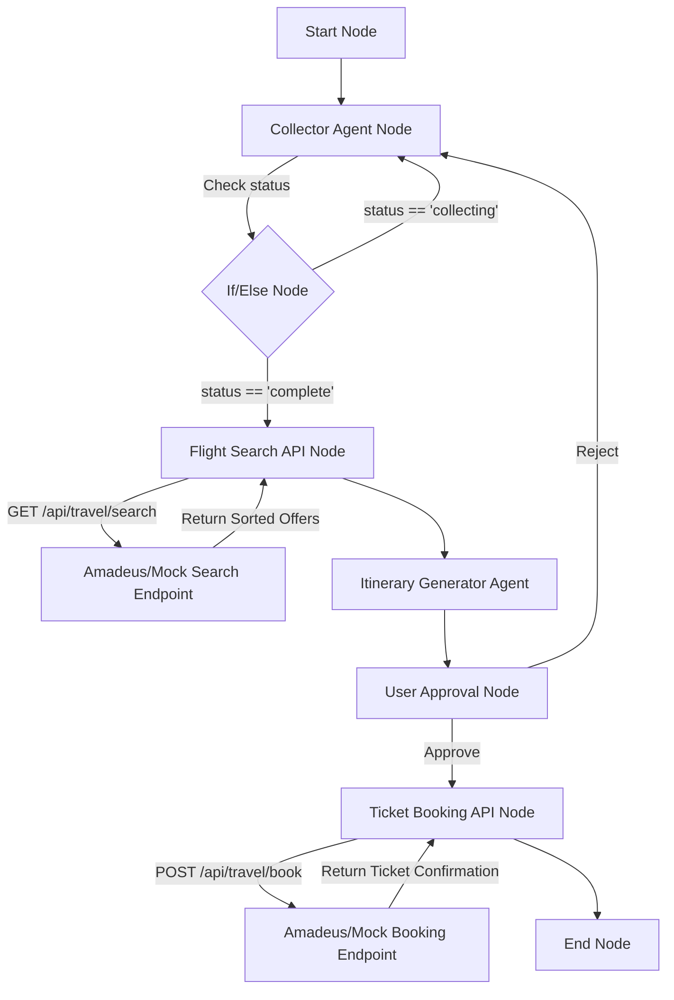

# 🚀 Trip Planner & Flight Booking Agent: Technical Handbook & Interview Guide

This handbook details the design, architecture, and step-by-step implementation of the automated **Trip Planner & Booking Agent** built within our AI Agent Visual Workflow Builder platform. It outlines production-grade challenges, compiler bug fixes, and serves as an interview preparation guide.

---

## 🏗️ Architecture Overview

The system is a human-in-the-loop, multi-agent visual automation pipeline that integrates external flight search and booking APIs.



---

## 🛠️ Step-by-Step Implementation

### Step 1: Design the Workflow Nodes
1. **Collector Agent Node (`TripCollector`)**: An AI agent instructed to collect `origin`, `destination` (IATA code), and `departureDate` from the user one by one. Once complete, it sets `status: "complete"`.
2. **If/Else Node**: Routes to flight search if `status === "complete"`, otherwise loops back to the collector agent.
3. **Flight Search API Node**: Calls the search endpoint passing parameters: `origin`, `destination`, and `departureDate`.
4. **Itinerary Generator Agent**: Receives search offers, displays carriers/prices, selects the cheapest flight, and sets variables `selectedOfferId` and `passengerId`.
5. **User Approval Node (`Confirm Booking`)**: Pauses the flow and displays the selected offer. If approved, routes to booking; if rejected, loops back to the collector agent.
6. **Ticket Booking API Node**: Sends a `POST` request to complete the flight booking.
7. **End Node**: Renders the final ticket confirmation code.

### Step 2: Implement the Amadeus & Mock Proxy Layer
To handle authorization, secure API keys, and bypass regional registration limits, we built a Next.js API proxy layer. If no credentials are set, it falls back to high-fidelity domestic mock flight data (IndiGo, Air India, Vistara):

* **GET `/api/travel/search`** ([route.ts](file:///c:/AI-Agent-Platform/ai-agent/app/api/travel/search/route.ts)):
  1. Requests OAuth 2.0 Access Token from Amadeus:
     `POST https://test.api.amadeus.com/v1/security/oauth2/token`
  2. Queries the flight offers search endpoint:
     `GET https://test.api.amadeus.com/v2/shopping/flight-offers`
  3. Returns normalized flight offers list and passenger ID.

* **POST `/api/travel/book`** ([route.ts](file:///c:/AI-Agent-Platform/ai-agent/app/api/travel/book/route.ts)):
  1. Receives booking parameters.
  2. Simulates an Amadeus order reservation and returns a ticket confirmation code.

---

## 🔑 Key Engineering & Compiler Challenges

### Challenge 1: Branching Node Compilation (`UserApprovalNode`)
* **The Problem**: The platform visual compiler in `preview/page.tsx` was hardcoded to check for a single outgoing connection (`if (connectedEdges.length === 1)`). For branching nodes like the `UserApprovalNode` (which has two handles: `approve` and `reject`), the compiler set `next: null`. This broke the connection, leaving the agent without access to the booking tool.
* **The Solution**: We updated the visual compiler to detect custom `sourceHandle` values (`approve` / `reject`) and output a branching object:
  ```typescript
  const approveEdge = connectedEdges.find((e: any) => e.sourceHandle === "approve");
  const rejectEdge = connectedEdges.find((e: any) => e.sourceHandle === "reject");
  if (approveEdge || rejectEdge) {
      next = {
          approve: approveEdge?.target || null,
          reject: rejectEdge?.target || null,
      };
  }
  ```
  This allowed the visual flow to retain branching paths, prompting the LLM compiler to correctly register booking API tools.

### Challenge 2: Tool Executor POST Request Body Support
* **The Problem**: The platform's tool calling executors (`agent-chat`, `agent-sdk`, and `trigger`) were hardcoded to execute simple `fetch(url)` GET requests. This meant POST APIs (like the Booking API Node) were hit with an empty request body and GET method, failing validation checks.
* **The Solution**: We updated all three execution routes to dynamically build `fetchOptions` based on the tool's configured `method`:
  ```typescript
  const fetchOptions: RequestInit = {
    method: t.method || "GET",
  };
  if (fetchOptions.method === "POST") {
    fetchOptions.headers = { "Content-Type": "application/json" };
    fetchOptions.body = JSON.stringify(params);
  }
  const response = await fetch(url, fetchOptions);
  ```

### Challenge 3: Seamless Local/Production URL Rewriting
* **The Problem**: API node URLs configured in the visual canvas (e.g. `http://localhost:3000/api/...`) fail when executed on production Vercel servers or Convex background schedulers.
* **The Solution**: We added dynamic base URL rewriting to the tool execution engines. If a URL is relative or contains `localhost:3000`, it translates it to the production `APP_URL` environment variable:
  ```typescript
  if (url.startsWith("/")) {
    url = `${process.env.APP_URL || "http://localhost:3000"}${url}`;
  } else if (url.includes("localhost:3000") && process.env.APP_URL) {
    url = url.replace("http://localhost:3000", process.env.APP_URL);
  }
  ```

---

## 🎯 Interview Q&A: Critical Challenges & Design Choices

### Q1: Why did we build a backend Next.js proxy layer for the Amadeus API instead of calling it directly from the visual API node?
**Answer**:
1. **OAuth 2.0 Lifecycle**: Amadeus requires a temporary access token generated via client ID and client secret, which expires in 30 minutes. A generic visual API node cannot handle token expiration, retrieval, and injection logic.
2. **Credential Security**: Storing Amadeus secrets in the visual builder database exposes them. The proxy layer keeps these credentials secure in the backend's serverless environment variables.
3. **Region Restrictions**: Duffel and Amadeus restrict free sign-ups based on countries of incorporation. The proxy layer allows us to seamlessly implement high-fidelity fallback mocks so developers in unsupported regions (like India) can build and run identical workflows.

### Q2: How does the AI agent orchestrate tools and handle variable injection under the hood?
**Answer**:
1. When the agent is rebooted, the frontend compiles the React Flow canvas into a JSON representation and sends it to `/api/generate-agent-tool-config`.
2. The GPT-4.1-mini model translates this visual structure into an OpenAI system prompt and tool definitions, binding input parameter schemas using **Zod**.
3. At runtime, the `@openai/agents` SDK creates the specialized agent instances. When the LLM decides to call a tool, it outputs a tool call JSON.
4. The router executes the tool code, replaces the placeholder variables (like `{{destination}}`) in the target URL, executes the fetch, and returns the response back to the LLM to complete the reasoning loop.

### Q3: Why did the agent fail with a "technical issue" when booking flights before our bugfix, even though it displayed flight options successfully?
**Answer**:
1. **LLM Hallucination**: The flight search was successful because the LLM simulated flight options based on its own training data (as no search API tool was correctly bound).
2. **Missing Tool Permission**: When the user requested booking, the LLM attempted to call the booking API. But because of the branching compilation bug (`connectedEdges.length === 1` check), the visual builder was compiling the User Approval node with `next: null`. This excluded the Ticket Booking API node from the agent's allowed tools list, resulting in a tool execution failure.
